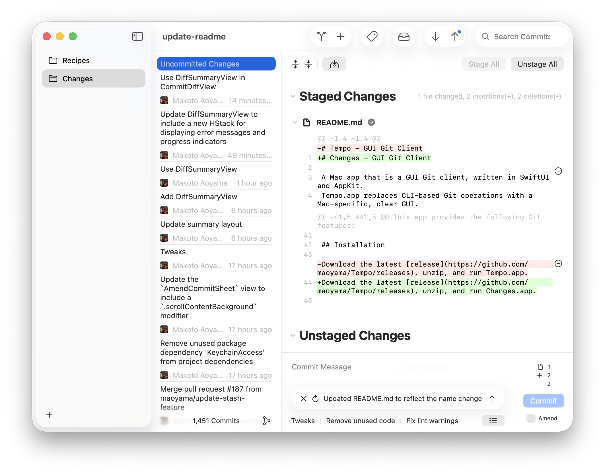
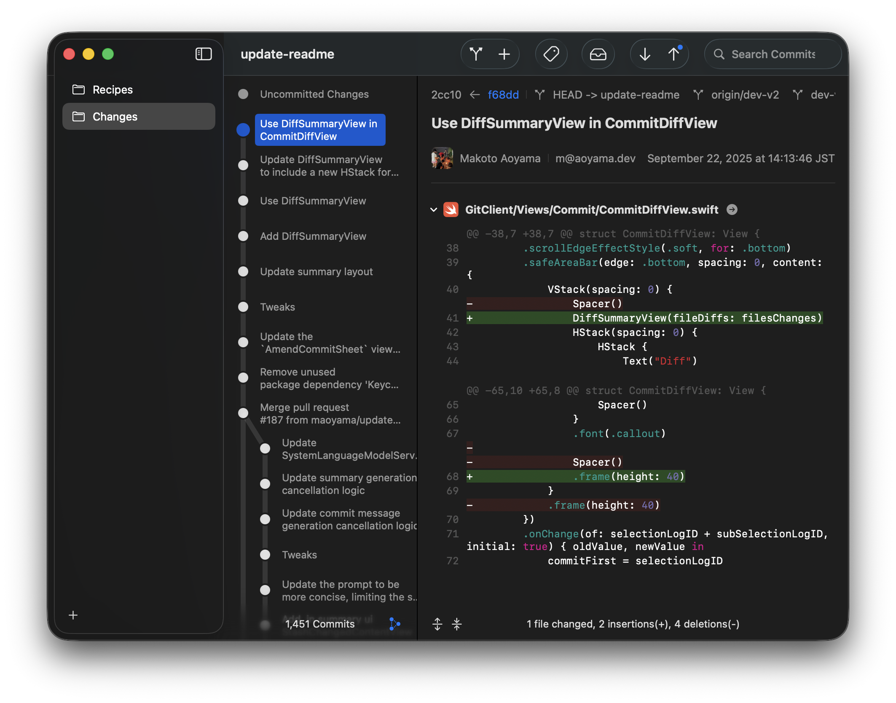

# Changes - An Open Source GUI Git Client for macOS

Changes.app is a modern Git client for Mac, built with SwiftUI and AppKit and styled with Apple’s new Liquid Glass design.  
It replaces complex CLI commands with a clear, Mac-native interface that keeps cognitive load low, so you can focus on what really matters—coding.  
With commit message generation powered by Apple Intelligence, creating clear and meaningful commits becomes effortless.

## Features

This app provides the following features:
- Commit
    - Amend
    - Commit Message Generation using Apple Intelligence
    - Commit Message Snippets
    - Revert
    - Checkout
- Add
    - Stage by Hunk
- Branch
    - Push
    - Pull
    - Merge
    - Create
    - Filter
- Tag
    - Create & Push
    - Delete
    - Filter
- Stash
    - Apply
- Search Commits
    - Commit Message
    - Changed (added/removed)
    - Author
    - Revision Range (e.g., main.., v1.0.0...v2.0.0)

## Installation

Download the latest [release](https://github.com/maoyama/Tempo/releases), unzip, and run Changes.app.

